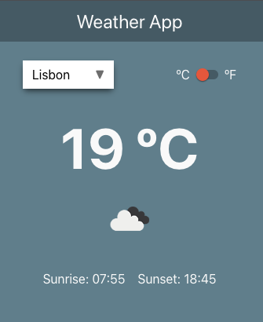

<p align="center">
  
</p>

<h1 align='center'>Weather App</h1>

Project built using the powerful [OpenWeatherMap API](https://openweathermap.org/api).

<p align="center">
  
  
</p>

## What is inside?

This project uses the following technologies:

- [React](https://reactjs.org/)
- [TypeScript](https://www.typescriptlang.org/)
- [Styled Components](https://styled-components.com/)
- [Storybook](https://storybook.js.org/)
- [Jest](https://jestjs.io/) & [React Testing Library](https://testing-library.com/docs/react-testing-library/intro)
- [React Query](https://tanstack.com/query/v4)
- [Eslint](https://eslint.org/)
- [Prettier](https://prettier.io/)
- [Husky](https://github.com/typicode/husky)
- [Vercel](https://vercel.com)
- [GitHub Actions](https://github.com/features/actions)

## Getting started
- Clone the project locally:
```sh
git clone https://github.com/scalfs/weather-app

cd ./weather-app
````

- Define the environment variables:

You\'ll need to create an account on [OpenWeatherMap](https://openweathermap.org/appid) to retrieve your own API Key. Once you have it, create a `.env` file similar to the existing `.env.example` at the root of the project. Write your key on the `REACT_APP_API_KEY` field, as indicated.

- Install dependencies using `yarn` or your prefered package manager:

```sh
# install dependencies
yarn

# start the development environment
yarn start
```

## Commands

- `start`: Runs the app in the development mode
- `test`: Launches the test runner in the interactive watch mode
- `lint`: Runs the linter in all components and pages
- `build`: Builds the app for production to the `build` folder
- `storybook`: Runs storybook on `localhost:6006`
- `build-storybook`: Create the build version of storybook

## Project structure

A summary of the main files and folder structure in this project.

```
├── public
├── src
│   ├── components
│     └── ui
│   ├── config
│   ├── context
│   ├── data
│   ├── hooks
│   ├── pages
│   ├── services
│   ├── styles
│   ├── utils
│   ├── index.tsx
```

1.  **`public`**: This directory contain all the assets like images, icons, manifest (PWA), and favicons.
2.  **`src`**: This directory contain all of the code related to what you see on the front-end of the application. `src` is a convention for “source code”.
    - **`__tests__`**: Contains files covering test cases of a utility function or a component.
    - **`components`**: Contains several React components with a single directory for each one. Each of them has a `stories` file also.
      - **`ui`**: Contains reusable components, divided followind atomic design convention (`atoms` and `molecules`).
    - **`config`**: Contains definitions and configurations used on the app.
    - **`context`**: Contains context files holding the logic related to the shared state between different components and pages.
    - **`data`**: Contains files representing the data we would get from the backend.
    - **`services`**: Contains the code related to communicating with external APIs.
    - **`styles`**: Contains the the `global` styles file and the `theme` file defining the desing system.
    - **`utils`**: Contains utility functions for a variety of tasks.
    - **`index.js`**: This is the first file which gets run in the browser after starting the application.

## Learn More

This project was bootstrapped with [Create React App](https://github.com/facebook/create-react-app). You can learn more in the [documentation](https://facebook.github.io/create-react-app/docs/getting-started).

To learn React, check out the [React documentation](https://reactjs.org/).
